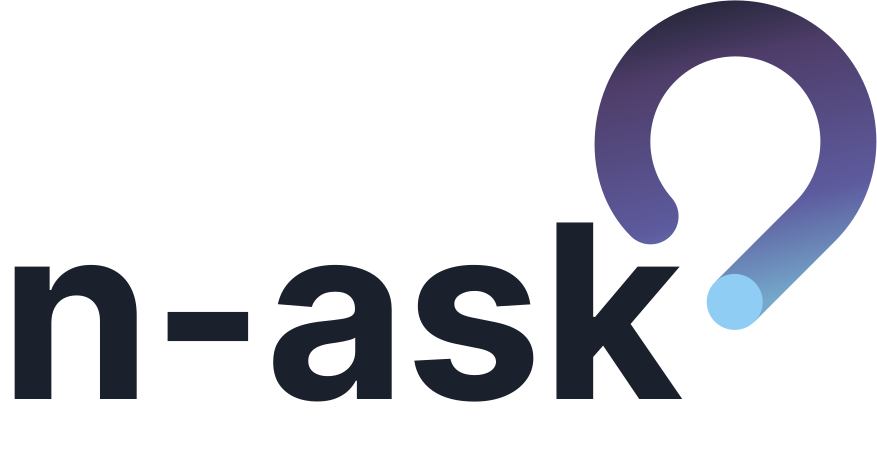

 

### Allow people to make n-ask

---

### 🔗 [Comece a usar o n-ask agora mesmo](https://n-ask.joaonasc.dev)

Ao criar uma sala, compartilhe o ID para que outras pessoas possam entrar e enviar perguntas.

## Autor

<table>
<td>

</td>
<td>

* Site: [joaonasc.dev](https://joaonasc.dev)
* Github: [@nascjoao](https://github.com/nascjoao)
* LinkedIn: [@nascjoao](https://linkedin.com/in/nascjoao)

</td>
</table>

## Suporte

Dê uma ⭐️ se esse projeto te ajudou!

---

Feito com muito 💚 por [@nascjoao](https://github.com/nascjoao)
